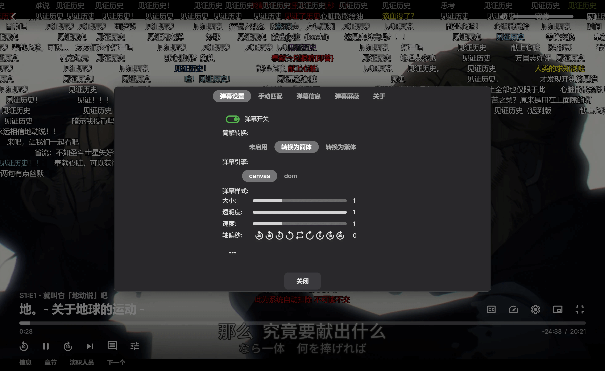
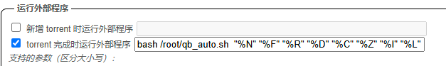
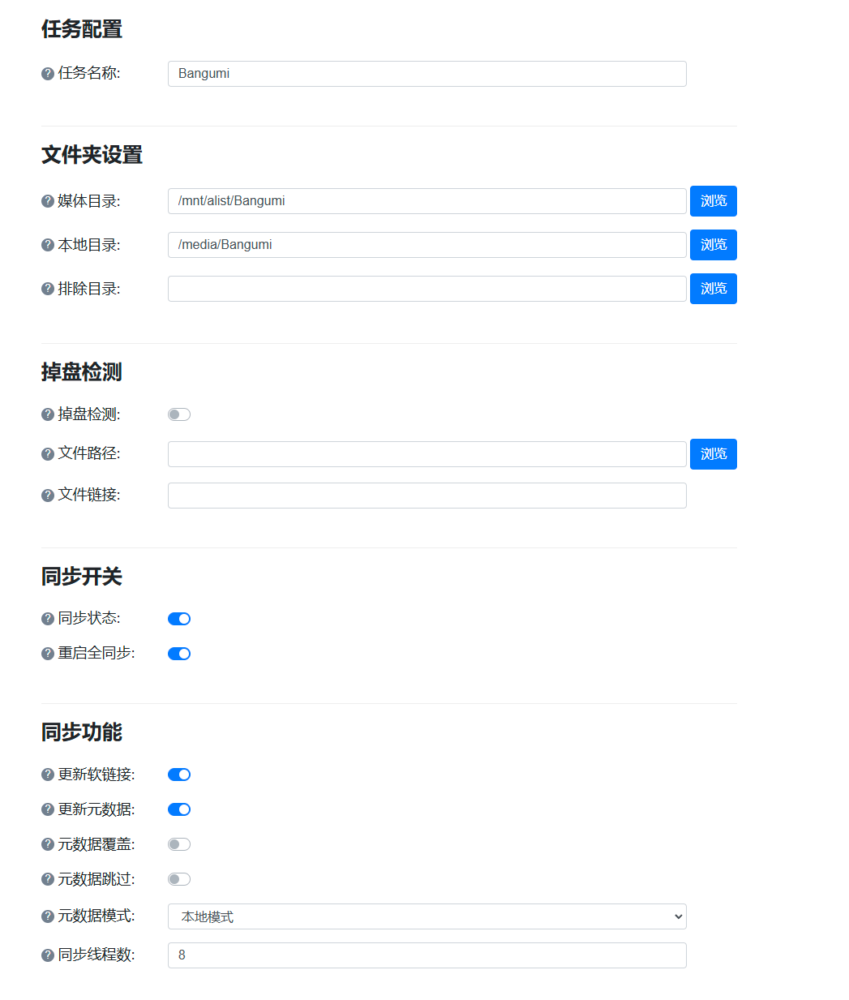
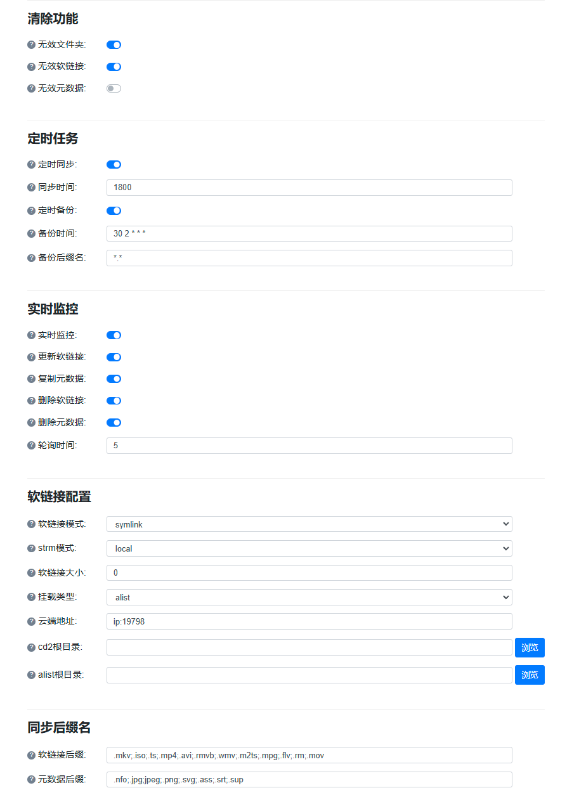
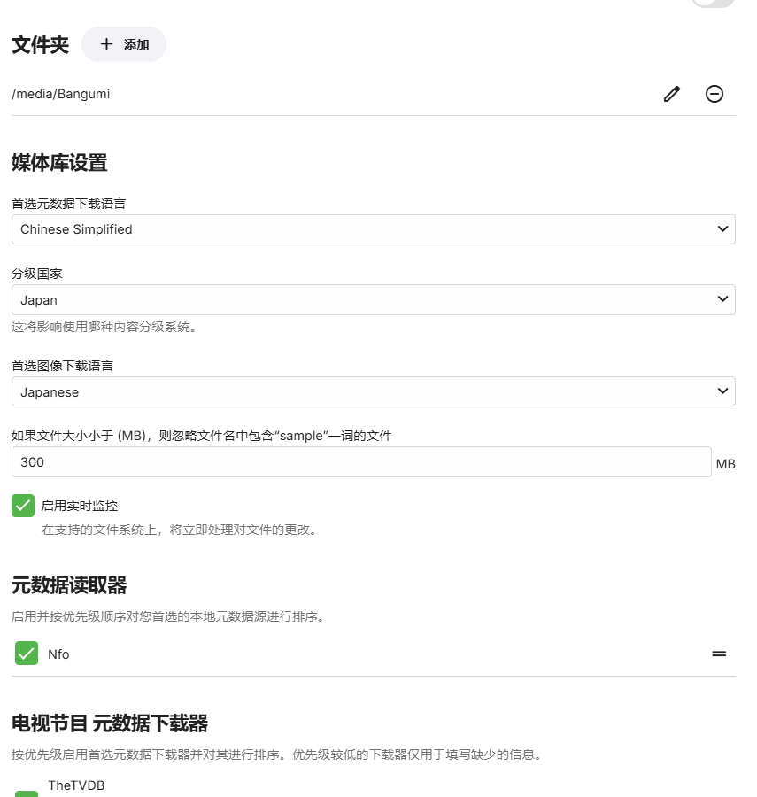

2025-02-24 更新，AutoBangumi 的怪事有点多，不如切换为 [Ani-rss](https://github.com/wushuo894/ani-rss)，本文也作了相应修改。

前阵子手上的 E5 订阅惨遭封禁，然后上了世纪互联车，准备倒腾一下自动化追番方案。然后就发现了一套自认为相当不错的方案，可以实现：

- 自动下载字幕组发布的新番资源，做种后释放空间。
- 番剧自动重命名为容易被 emby 等媒体库刮削的格式，并上传至网盘。
- emby 媒体库弹幕支持。
- emby 媒体库播放番剧，流量不走 VPS，直接通过 302 重定向到网盘。（需要网盘支持）

其中最后一个特性也很适合网盘有大量媒体资源，想做成媒体库的朋友们。

<!-- more -->

**效果展示：**




## 前提

- 一台小鸡，配置不用很高，带宽和硬盘均没有特别高的要求，因为资源都在云上。（如果没有公网访问需求直接拿 PC 也行）
- 一个支持 302 重定向的网盘（OD，阿里云盘等）
- Nginx 和 njs module

### 我的环境

- Ubuntu 22.04.5 LTS
- 2 vCPU, 1GB RAM 40GB Disk
- OneDrive 世纪互联

## 详细部署

### Alist

- 添加网盘，提供 302 重定向。

安装配置非常简单，按照 [官方文档](https://alist.nn.ci/) 进行部署即可。

**注意：**
- 存储建立时，「WEBDAV 策略」一定要选「302 重定向」。
- 需要开启 WEBDAV 功能。

---

### Rclone

- 将 Alist 挂载到本地。
- 将 qBittorrent 下载的种子上传到网盘。

此处说明简略，更详细的配置流程请自行上网搜索。

#### 安装

[官方](https://rclone.org) 一键脚本:

```sh
sudo -v ; curl https://rclone.org/install.sh | sudo bash
```

#### 配置

 `rclone config` 添加 remote 配置，将 Alist 添加为 WEBDAV。

- WEBDAV 参数参照 [Alist 文档](https://alist.nn.ci/guide/webdav.html)

| Name     | Value                    |
| -------- | ------------------------ |
| Url      | https://domain:port/dav/ |
| Host     | domain                   |
| Path     | dav                      |
| Scheme   | http/https               |
| Port     | Same as web port         |
| Username | Same as web username     |
| Password | Same as web password     |

#### 挂载 Alist 到本地

创建后台脚本：

```sh
nano /etc/systemd/system/rclone-mount.service
```

粘贴以下文本，并适当修改：

```ini
[Unit]
Description=Mount Rclone
After=network-online.target
Wants=network-online.target

[Service]
ExecStart=/usr/bin/rclone mount alist: /mnt/alist  \
--allow-other --vfs-cache-mode=full  \
--allow-non-empty  --vfs-read-chunk-size=4M --buffer-size=32M
ExecStop=/bin/fusermount -u /mnt/alist
Restart=on-failure
User=root


[Install]
WantedBy=multi-user.target
```

- rclone mount 使用：`rclone mount remote:path/to/files /path/to/local/mount`

服务创建完后，启动挂载：

```sh
systemctl enable rclone-mount.service
systemctl start rclone-mount.service
```

如果配置正确，此时 `ls` 查看你设置的挂载路径，应该可以看到 alist 中的文件。

```sh
ls /mnt/alist
 Anime    Bangumi  ...
```

---

### qBittorrent

建议设置合适的保种时长，避免吸血。

#### 安装

推荐使用增强版：[GitHub](https://github.com/c0re100/qBittorrent-Enhanced-Edition)

**强烈建议**在「Bittorrent」设置页面将做种时长设置在 1 天以上。

#### 配置后台运行

```sh
nano /etc/systemd/system/qbittorrent.service
```

粘贴以下配置：

```ini
[Unit]
Description=qBittorrent Enhanced Edition Service
After=network.target

[Service]
Type=simple
User=root
LimitNOFILE=32768
ExecStart=/usr/bin/qbittorrent-nox
TimeoutSec=120

[Install]
WantedBy=multi-user.target
```

启动 qBittorrent

```sh
systemctl enable qbittorrent
systemctl start qbittorrent
```

#### 设置 Rclone 上传脚本
**如果是用 Ani-rss，跳过这一步，用 Ani-rss 自带的 alist 上传，效果更好一些。**
脚本原地址：[【更新分享率控制】qBittorrent + Rclone 自动上传脚本](https://hostloc.com/thread-612238-1-1.html)

我做了少量修改，可以额外实现：

- `Bangumi` 分类的种子等待 [AutoBangumi](#AutoBangumi) 重命名后上传。
- 上传到路径与种子保持路径一致。
- 单文件种子创建文件夹上传。

访问网页进行配置，默认端口为 `8080`

进入设置，在「连接」窗口，勾选「Torrent 完成时运行外部程序」，然后输入：

```
bash /root/qb_auto.sh  "%N" "%F" "%R" "%D" "%C" "%Z" "%I" "%L"
```



创建脚本：

```sh
nano qb_auto.sh
```

粘贴以下内容：

```bash
#!/bin/sh
torrent_name=$1
content_dir=$2
root_dir=$3
save_dir=$4
files_num=$5
torrent_size=$6
torrent_hash=$7
torrent_type=$8

qb_version="4.5.4"
qb_username="admin"
qb_password="yourpassword"
qb_web_url="http://localhost:8080"
leeching_mode="false"
log_dir="/root/qblog"
rclone_dest="od"
rclone_parallel="5"
auto_del_flag="rcloned"

if [ ! -d ${log_dir} ]
then
	mkdir -p ${log_dir}
fi

version=$(echo $qb_version | grep -P -o "([0-9]\.){2}[0-9]" | sed s/\\.//g)

function qb_login(){
	if [ ${version} -gt 404 ]
	then
		qb_v="1"
		cookie=$(curl -i --header "Referer: ${qb_web_url}" --data "username=${qb_username}&password=${qb_password}" "${qb_web_url}/api/v2/auth/login" | grep -P -o 'SID=\S{32}')
		if [ -n ${cookie} ]
		then
			echo "[$(date '+%Y-%m-%d %H:%M:%S')] 登录成功！cookie:${cookie}" >> ${log_dir}/autodel.log

		else
			echo "[$(date '+%Y-%m-%d %H:%M:%S')] 登录失败！" >> ${log_dir}/autodel.log
		fi
	elif [[ ${version} -le 404 && ${version} -ge 320 ]]
	then
		qb_v="2"
		cookie=$(curl -i --header "Referer: ${qb_web_url}" --data "username=${qb_username}&password=${qb_password}" "${qb_web_url}/login" | grep -P -o 'SID=\S{32}')
		if [ -n ${cookie} ]
		then
			echo "[$(date '+%Y-%m-%d %H:%M:%S')] 登录成功！cookie:${cookie}" >> ${log_dir}/autodel.log
		else
			echo "[$(date '+%Y-%m-%d %H:%M:%S')] 登录失败" >> ${log_dir}/autodel.log
		fi
	elif [[ ${version} -ge 310 && ${version} -lt 320 ]]
	then
		qb_v="3"
		echo "陈年老版本，请及时升级"
		exit
	else
		qb_v="0"
		exit
	fi
}

function qb_del(){
	if [ ${leeching_mode} == "true" ]
	then
		if [ ${qb_v} == "1" ]
		then
			curl "${qb_web_url}/api/v2/torrents/delete?hashes=${torrent_hash}&deleteFiles=true" --cookie ${cookie}
			echo "[$(date '+%Y-%m-%d %H:%M:%S')] 删除成功！种子名称:${torrent_name}" >> ${log_dir}/qb.log
		elif [ ${qb_v} == "2" ]
		then
			curl -X POST -d "hashes=${torrent_hash}" "${qb_web_url}/command/deletePerm" --cookie ${cookie}
		else
			echo "[$(date '+%Y-%m-%d %H:%M:%S')] 删除成功！种子文件:${torrent_name}" >> ${log_dir}/qb.log
			echo "qb_v=${qb_v}" >> ${log_dir}/qb.log
		fi
	else
		echo "[$(date '+%Y-%m-%d %H:%M:%S')] 不自动删除已上传种子" >> ${log_dir}/qb.log
	fi
}

function rclone_copy(){
	if [ ${type} == "file" ]
	then
		if [ ${torrent_type} == "Bangumi" ]
		then
			sleep 15
			content_dir=$(find "${save_dir}" -type f -size ${torrent_size}c)
		fi
		rclone_copy_cmd=$(rclone -v copy --transfers ${rclone_parallel} --log-file  ${log_dir}/qbauto_copy.log "${content_dir}" ${rclone_dest}:"${save_dir:5}")
	elif [ ${type} == "dir" ]
	then
		rclone_copy_cmd=$(rclone -v copy --transfers ${rclone_parallel} --log-file ${log_dir}/qbauto_copy.log "${content_dir}"/ ${rclone_dest}:"${content_dir:5}"/)
	fi
}

function qb_add_auto_del_tags(){
	if [ ${qb_v} == "1" ]
	then
		curl -X POST -d "hashes=${torrent_hash}&tags=${auto_del_flag}" "${qb_web_url}/api/v2/torrents/addTags" --cookie "${cookie}"
	elif [ ${qb_v} == "2" ]
	then
		curl -X POST -d "hashes=${torrent_hash}&category=${auto_del_flag}" "${qb_web_url}/command/setCategory" --cookie ${cookie}
	else
		echo "qb_v=${qb_v}" >> ${log_dir}/qb.log
	fi
}
if [ ${torrent_type} == "Bangumi" ]
then
	echo "AutoBangumi" >> ${log_dir}/qb.log
fi
if [ -f "${content_dir}" ]
then
   echo "[$(date '+%Y-%m-%d %H:%M:%S')] 类型：文件" >> ${log_dir}/qb.log
   type="file"
   rclone_copy
   qb_login
   qb_add_auto_del_tags
   qb_del
elif [ -d "${content_dir}" ]
then 
   echo "[$(date '+%Y-%m-%d %H:%M:%S')] 类型：目录" >> ${log_dir}/qb.log
   type="dir"
   rclone_copy
   qb_login
   qb_add_auto_del_tags
   qb_del
else
   echo "[$(date '+%Y-%m-%d %H:%M:%S')] 未知类型，取消上传" >> ${log_dir}/qb.log
fi

echo "种子名称：${torrent_name}" >> ${log_dir}/qb.log
echo "内容路径：${content_dir}" >> ${log_dir}/qb.log
echo "根目录：${root_dir}" >> ${log_dir}/qb.log
echo "保存路径：${save_dir}" >> ${log_dir}/qb.log
echo "文件数：${files_num}" >> ${log_dir}/qb.log
echo "文件大小：${torrent_size}Bytes" >> ${log_dir}/qb.log
echo "HASH:${torrent_hash}" >> ${log_dir}/qb.log
echo "Cookie:${cookie}" >> ${log_dir}/qb.log
echo -e "-------------------------------------------------------------\n" >> ${log_dir}/qb.log


```

说明：

- 默认情况下，保存路径为 `/root/path/to/torrent` 的种子，上传到网盘的路径为 `/path/to/torrent`，也就是会把 `/root` 部分删除。可以按需修改 `rclone_copy` 函数。

```sh
chmod +x qb_auto.sh
```

---

### AutoBangumi
建议使用 [Ani-rss](#Ani-rss)
- Rss 获取番剧资源，推送到 [qBittorrent](#qBittorrent) 进行下载
- 自动化番剧重命名，便于 emby 刮削。

官方地址：<https://www.autobangumi.org>

安装和初始配置官方教程很详细，这里不赘述。

**注意：**

- 在「番剧管理设置」里，将「添加组标签」勾选。
- 「重命名间隔」设置为 5

---
### Ani-rss
[官方文档](https://docs.wushuo.top/)很详细，直接照着部署就行，建议通过 docker 部署，记得路径映射正确，不然 Alist 无法上传。
```yml
services:
  ani-rss:
    container_name: ani-rss
    volumes:
      - /root/docker/ani/config:/config
      - /root/Media:/root/Media
    ports:
      - 7789:7789
    environment:
      - PORT=7789
      - CONFIG=/config
      - TZ=Asia/Shanghai
    restart: always
    image: wushuo894/ani-rss
```
### AutoSymlink

- 对挂载文件添加 symlink 软链接，加快扫盘速度。
- 方便保存元数据，加快读取。

项目地址：[GitHub](https://github.com/shenxianmq/Auto_Symlink)

#### 安装

这里采用 `docker-compose` 安装。

```sh
mkdir symlink && cd symlink
mkdir config
```

创建 `docker-compose.yml` 配置文件，粘贴以下内容，并根据情况修改。

```yml
version: '3'

services:
  auto_symlink:
    image: shenxianmq/auto_symlink:latest
    container_name: auto_symlink
    environment:
      - TZ=Asia/Shanghai
    volumes:
      - /mnt/alist:/mnt/alist:rslave # 挂载目录
      - /media:/media # emby扫描媒体目录
      - ./config:/app/config
    ports:
      - "8095:8095"
    user: "0:0"
    restart: unless-stopped
```

#### 配置

访问对应端口进行网页配置，点左侧「添加任务」。示例配置如下：





说明：

- **媒体目录**即挂载的路径。**本地目录**即 symlink 文件及元数据存放目录。
- 模式全部选本地。
- 同步时间以秒为单位，推荐设定：3600。如果是固定不同的媒体资源而不是新番资源，推荐关闭自动同步。
此时正确配置后，原本挂载路径 `/mnt/alist/Bangumi` 中的媒体资源，会通过软链接到 `/media/Bangumi`

---

### emby

- 媒体库，能获取弹弹 play 上的弹幕。
- 支持外链播放。

#### 安装

emby 媒体库搭建，用 [amilys](https://hub.docker.com/r/amilys/embyserver) 的魔改版。这里采用 docker-compose 安装。

```sh
mkdir emby && cd emby
mkdir config 
```

创建 `docker-compose.yml` 文件，将以下内容按需修改后复制。

```yml
services:
  emby-server:
    image: amilys/embyserver
    container_name: emby-local
    network_mode: bridge # DLNA and Wake-on-Lan需要bridge
    environment:
      - UID=0 
      - GID=0 
      - GIDLIST=0 
      - TZ=Asia/Shanghai 
    devices:
      - /dev/dri:/dev/dri             # 将主机的 /dev/dri 设备挂载到容器 开启硬解
    ports:
      - 8096:8096 # 对外访问端口
    restart: unless-stopped
    privileged: true
    volumes:
      - ./config:/config
      - /mnt/alist:/mnt/alist:shared # 这个路径直接读取挂载文件
	  - /media:/media:shared         # 这个路径是 symlink 软链接路径
```

#### 配置



注意：

- 访问网页完成基础配置后，重启 embyserver 后，能在 `./config/config` 路径下找到 `ext.sh` 脚本，按照脚本中的注释进行配置，即可开始弹幕等功能。
- 媒体库路径填通过 [AutoSymlink](#AutoSymlink) 获取的 symlink 路径。这里是 `/media`
- 刮削器建议只选 `theMovieDB`，皮实够用。

---

### emby2Alist

项目地址：[GitHub](https://github.com/bpking1/embyExternalUrl)

另外 emby 内的外链播放也是这个项目的，赞👍

> 将阿里盘及别的网盘的文件转为直链,使用 nginx 及其 njs 模块将 emby 视频播放地址劫持到 alist 直链

此外还有一个类似的项目：[GO-emby2Alist](https://github.com/AmbitiousJun/go-emby2alist)，没有测试过。

#### 安装

确保本地有 Nginx，以及 njs 模块。

下载项目源码到本地，解压提取，我们只需要用到 `/emby2Alist/nginx/conf.d` 这个文件夹。将这个文件夹移动到 Nginx 配置目录。

```sh
wget https://github.com/bpking1/embyExternalUrl/archive/refs/tags/v0.4.6.zip
unzip v0.4.6.zip && rm v0.4.6.zip
mv ./embyExternalUrl-0.4.6/emby2Alist/nginx/conf.d /etc/nginx/
```

#### 配置

1. 修改 `conf.d/constant.js` 文件
```js
// 这里默认 emby/jellyfin 的地址是宿主机,要注意 iptables 给容器放行端口
const embyHost = "http://localhost:8096";

// emby/jellyfin api key, 在 emby/jellyfin 后台设置
const embyApiKey = "39bbbeaxxxxxxxxx5b0";

// 挂载工具 rclone/CD2 多出来的挂载目录, 例如将 od,gd 挂载到 /mnt 目录下: /mnt/onedrive /mnt/gd ,那么这里就填写 /mnt
// 通常配置一个远程挂载根路径就够了,默认非此路径开头文件将转给原始 emby 处理
// 如果没有挂载,全部使用 strm 文件,此项填[""],必须要是数组
const mediaMountPath = [""];
```

- 本文采用 symlink 软链接 （如果用 strm，也一样），确保 `mediaMountPath` 的值为空。

2. 修改 `conf.d/config/constant-mount.js` 
```js
// 访问宿主机上 5244 端口的 alist 地址, 要注意 iptables 给容器放行端口
const alistAddr = "http://localhost:5244";

// alist token, 在 alist 后台查看 alist 令牌
const alistToken = "alist-xxxx";

// alist 是否启用了 sign
const alistSignEnable = false;

// alist 中设置的直链过期时间,以小时为单位,严格对照 alist 设置 => 全局 => 直链有效期
const alistSignExpireTime = 0;
```

3. 修改 `conf.d/config/constant-pro.js`
```js
// 路径映射,会在 mediaMountPath 之后从上到下依次全部替换一遍,不要有重叠,注意 /mnt 会先被移除掉了
// 参数?.1: 生效规则三维数组,有时下列参数序号加一,优先级在参数2之后,需同时满足,多个组是或关系(任一匹配)
// 参数1: 0: 默认做字符串替换 replace 一次, 1: 前插, 2: 尾插, 3: replaceAll 替换全部
// 参数2: 0: 默认只处理本地路径且不为 strm, 1: 只处理 strm 内部为/开头的相对路径, 2: 只处理 strm 内部为远程链接的, 3: 全部处理
// 参数3: 来源, 参数4: 目标
const mediaPathMapping = [
     [0, 0, "/media", ""]
]
```

注意：

 - `/media` 为 symlink 软链接存放的地址，如果采用 strm，这里填写 `[0, 1, "/mnt/alist", ""]` , 其中 `/mnt/alist` 是挂载路径相对于 alist 路径多出来的部分。如同样的 Bangumi 文件夹，在 Alist 中的路径为 `https://yourdomain.com/Bangumi` , 在挂载中的路径为 `/mnt/alist/Bangumi`。

 完成后重载 Nginx 配置，就能正常工作了。访问 8091 端口，就能访问直链劫持 Alist 的 emby 媒体库了。

## 参考

https://linux.do/t/topic/259509
