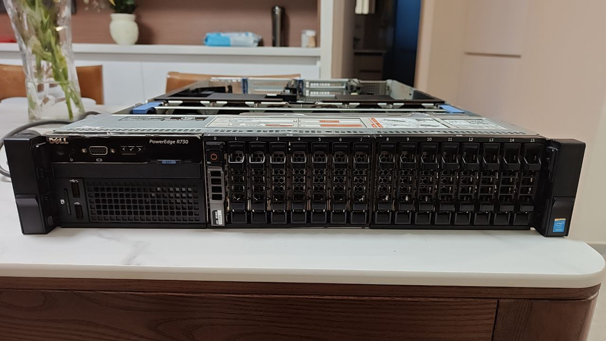
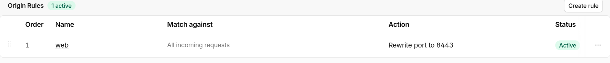
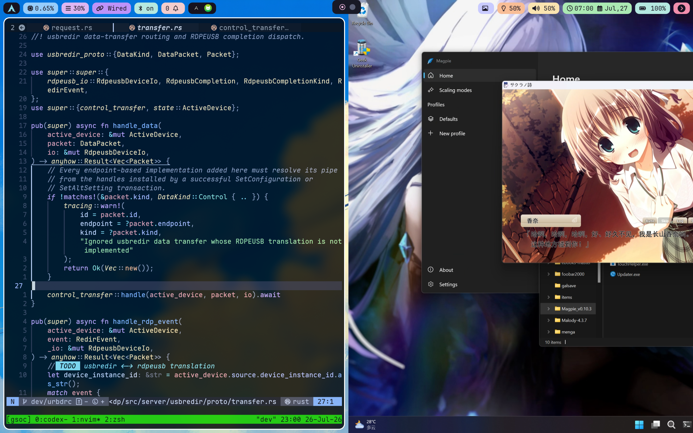

+++
title = "一台 R730 的 Homelab：组网、公网访问与远程使用"
description = "记录一套运行在 Proxmox VE 上的 Homelab：通过虚拟路由、IPv6 和 DMZ 划分网络边界，并使用 LXC、Nginx 与 ZeroTier 承载内外网服务。"
date = 2026-07-27
draft = false

[taxonomies]
categories = ["Tinkering"]
tags = ["homelab", "Linux", "proxmox", "pve"]
+++

## 碎碎念

机器是去年寒假从我的菩萨朋友 [@Macesuted][mace] 家里迁过来的. 还记得他手里攥着满满一叠「黄金」造访我家的样子:

{{ figure(src="memory_showup.jpg", width="363") }}

他第二天还要回上海, 所以跟我一起装完硬件就匆匆离去了, 他真的, 我哭死. 感谢我的大善人朋友 :)

截至写此文的时候, 服务器已经稳定运行大半年, 除了不久前才发生的停电事件, 一次也没有 down 过, 还是非常稳定的. 其实很早就想分享一下这套架构的, 可是一直没有时间 (~~其实是因为懒~~), 而最近在外实习, 进一步感受到了这套 homelab 方案的优雅丝滑, 遂有了此文.

---

## 环境

### 硬件

| Hardware | Configuration                                              |
| :------- | :--------------------------------------------------------- |
| Server   | Dell PowerEdge R730 (16 盘位 x 2.5 寸)                         |
| CPUs     | 56 x Intel(R) Xeon(R) CPU E5-2680 v4 @ 2.40GHz (2 Sockets) |
| RAM      | 6 x 16G DDR4 ECC                                           |
| RAID     | Dell PERC H730 Mini                                        |
| Storage  | 8 x 900G SAS HDD                                           |
| Network  | 四口千兆电口                                                     |
| Power    | 750W EPP, 可 1+1 冗余升级                                       |

机器安装 Proxmox VE.

---

### 存储

使用软 raid. 将 RAID 卡设置为 HBA (直通) 模式, 然后使用 zfs raidz 2-0, 2 块冗余盘. raw size 7.18T 除去冗余后 4.43T.

---

### 网络

四个电口 (`eno1`, `eno2`, `eno3`, `eno4`). 实际用到两个, `eno1` 连接光猫, `eno2` 连接交换机. 显然我无法把整个服务器塞进弱电箱, 所以实际的布线是挺丑陋的: 交换机塞进弱电箱, 然后两根线探出弱电箱连到机器上. 具体配置见后文.

---

## 组网

组网核心围绕公网访问展开, 这也是这套 homelab 网络架构中最精华的部分. 之前机器在 [@Macesuted][mace] 家的时候, 公网访问主要是通过公网流量机 + FRP 实现的. 可既然机器到了自己家里, 有了对整个网络结构的控制权, 我想尝试一下不额外购买公网机来实现公网访问. (不止是内网穿透, 而是能在任何接入 Internet 的网路环境下的公网访问).

---

### Internet Setup

先接管运营商自带的孱弱路由器. 联系宽带师傅获取超管密码和宽带账号后, 把光猫改成桥接, 然后就可以把自带的路由器下线了, 或者 cosplay AP.

由此光猫就变成纯粹的光猫, 只作光电信号转换. 然后路由就可以由我们自己控制了, 少了一层 NAT.

路由方案采用经典的主旁路由方案: 主路由 ikuai, 负责基础的拨号上网 + 路由; 旁路由 iStoreOS (预装的功能有点多, 下次回家可能要换成 immortalWrt), 其插件系统能提供更多的高级玩法.

在 PVE 中创建两个 VM 并刷入对应的系统, 然后来配置 bridge:

| bridge  | 网段            | Ports          | 用途  |
| ------- | ------------- | -------------- | --- |
| `vmbr0` | 10.10.10.0/24 | `eno2` (连接交换机) | 主内网 |
| `vmbr1` |               | `eno1` (连接光猫)  | WAN |
| `vmbr2` | 10.10.20.0/24 |                | DMZ |

说明一下 vmbr2: 计划将后续能公网直接访问的容器或虚拟机放在此网段用于安全隔离.

PVE 宿主机接入 vmbr0, IP: `10.10.10.2`

VMs 配置:

| VM       | 接口                                                       | 地址                           |
| -------- | -------------------------------------------------------- | ---------------------------- |
| ikuai    | `eth0` - `vmbr0` `eth1` - `vmbr1` `eth2` - `vmbr2` | `10.10.10.1` `10.10.20.1` |
| iStoreOS | `eth0` - `vmbr0` `eth1` - `vmbr2`                     | `10.10.10.3` `10.10.20.3` |

在主路由的 `eth2` 接口设置 WAN, 完成 PPPoE 拨号. 然后配置好 DHCP 和 DNS, 家里就可以连上 Internet 了.

旁路由配置好两个 LAN 口即可. 关闭 DHCP 否则要和主路由撞车. 高级功能先不配置.

---

### Public Access

Ok 现在可以来折腾公网访问了. 原本打算利用 fullcone NAT 来直接实现 IPv4 打洞. 原理见 [Natter: 在 NAT1 下开放公网 TCP 端口](https://www.v2ex.com/t/879549), 简单来说是利用 fullcone NAT 端口重用的特性, 用长连接占据一个端口, 然后用 STUN 服务器查到这个端口和公网地址, 然后就能使用了. 我甚至还用 rust 重写了一个版本 ([nyat](https://github.com/uchout/nyat)), 添加了多任务模式. 但是只能在主路由上使用, 而我不是很想让主路由的 IP 直接暴露 (后续还要做 DDNS, 被锁定了很容易被攻击), 并且希望主路由不承担过多的功能, 于是放弃.

最终选择的方法是拨 IPv6. 我所使用的运营商是支持动态公网 v6 的, 所以在 ikuai 主路由中给 `eth1` (WAN 口) 配置 DHCPv6 即可. 然后只给 `eth2` (DMZ) 开启自动分配模式, 也就是接入公网 v6, `eth0` (主内网) 静态分配内网 `fd00:10::1/64`, 保障安全. 同时配置防火墙阻断 `eth2` 到 `eth0` 的请求, 进一步保障安全.

至此, 接入 `vmbr2`, 也就是 `10.10.20.0/24` 网段的主机都能获得独立的 IPv6 地址. 不过这个地址是动态的, 为了方便使用可以配置一个 ddns. 写个脚本就能解决, 轮询 IPv6 对应接口的地址, 发生变动了发一个域名更新请求到域名服务商即可.

---

## 使用

### web

web 是最常见的公网访问需求. 我打算在 DMZ 区域开一个容器专门用来跑 nginx 反代. 这样只需要做一次 ddns, 然后 web 服务就可以直接放在主内网中, 由 nginx 反代获得公网访问.

这个容器取名为 ingress, 配置如下:

| interface | bridge  | IP          | Gateway    |
| --------- | ------- | ----------- | ---------- |
| `eth0`    | `vmbr2` | 10.10.20.11 |            |
| `eth1`    | `vmbr0` | 10.10.10.5  | 10.10.10.1 |

这个容器同时接入了 DMZ 和主内网, 是唯一可能通过公网入侵主内网的突破口. 但是为了 web 服务能够在主内网中高速访问, 只能做出妥协. 只能祈祷 nginx 没有安全漏洞了. 并且可以给 ddns 绑定的域名套 CDN 来防止公网 IP 直接暴露, 以及配置防火墙来解决.

ikuai 里我添加了一则 ACL 规则, 阻断 10.10.20.0/24 对 10.10.10.0/24 的请求, 来保障主内网的安全.

ddns 域名我用的是 cloudflare, 并且通过自定义主机回退源实现 CDN 优选. 优选地址用的 visa.com. 开启 CDN 不仅可以防止 IP 直接暴露, cloudflare 大爹还提供了 v4 v6 双栈翻译功能, 也就是在没有 IPv6 的外网场景也可以访问.

小插曲: 443 端口存活了大概一周就被我的运营商 ban 了. 于是我迁移到了 8443 端口, 并且用 cloudflare 的 rule 功能将 443 端口访问重写至 8443 端口, 实现域名不带端口号直接访问.

---

### P2P 访问

主内网的有些敏感内容不适合通过 ingress nginx 反代直接暴露到公网, 比如 PVE 的 web 管理页. 此时可以通过搭建 zerotier 虚拟局域网来实现 P2P 内网穿透. 由于现在家庭的网络结构已经非常不错了, 从运营商入户到主内网仅一层 NAT. 我在外面实测没有遇到无法建立 P2P 通道的情况.

zerotier 搭建在旁路由 iStoreOS 上, 在 zerotier 的 dashboard 配置一个路由, 就能实现在外的 zt 局域网设备直接通过主内网 IP 访问设备. 我的旁路由的 zt 局域网 IP 为 172.2.2.1, 因此添加 `10.10.10.0/24 via 172.2.2.1` 和 `10.10.20.0/24 via 172.2.2.1` 即可 p2p 访问主内网和 DMZ 中的设备.

---

### 透明代理

旁路由装个 openclash, 然后把需要走透明代理的设备的 gateway 从默认的主路由地址 10.10.10.1 / 10.10.20.1 改成旁路由地址 10.10.10.3 / 10.10.20.3 即可实现科学上网. 我的 dev 机就是这么操作的, KitKit 的自动化机器人也是这么接入代理的, 在里面跑 cc-connect 和 codex / claude code 非常丝滑.

{{ figure(src="devel.png", alt="ssh + tmux, 光标延迟完全无感", caption="ssh + tmux, 光标延迟完全无感", width="500") }}

---

### 远程访问 PC

家里的台式机肯定不能随我出行. 既然现在有了主内网访问能力, 就可以用 moonlight + sunshine 实现远程桌面访问啦. Sunshine 推荐选择 [基地版](https://github.com/AlkaidLab/foundation-sunshine), 可以实现远程桌面建立后自动关闭对面的显示器, 这样就可以~~防止家人偷窥我打 galgame 了~~ 严肃使用 Microsoft Office 办公了. windows 可以开启 WOL, 这样还能远程开关机, 省电. 不过有个坑点, 远程桌面连接状态下直接关机, 第二次开机后 sunshine 有极大概率崩溃. 所以远程关机得靠 ssh.

---

## 总结

总的来说, 服务大多跑在主内网以保障安全性. 之前在 [mace][mace] 家的时候, 因为只有一台机子, 所以想跑很多服务采用的是 docker / podman. 而现在可以直接一个服务一个 lxc 容器, 开始有点分布式的味道了! 而且有个很好用的 homelab 玩家社区 [community script](https://community-scripts.org/), 里面包装好了很多常见的 lxc 容器, 尝试提供像 docker 一样便捷的服务搭建方式.

{{ figure(src="lxc.png", alt="我跑的一些服务", caption="我跑的一些服务", width="500") }}

直接需要公网发现的服务, 比如 syncthing, qBittorrent 就跑在 DMZ 区域. web 服务统一走 ingress 容器的 nginx 反代.

拿 cc 画了个拓扑图:

{{ figure(src="topology.svg", alt="homelab topology", caption="homelab topology") }}

[mace]: <https://macesuted.moe>
