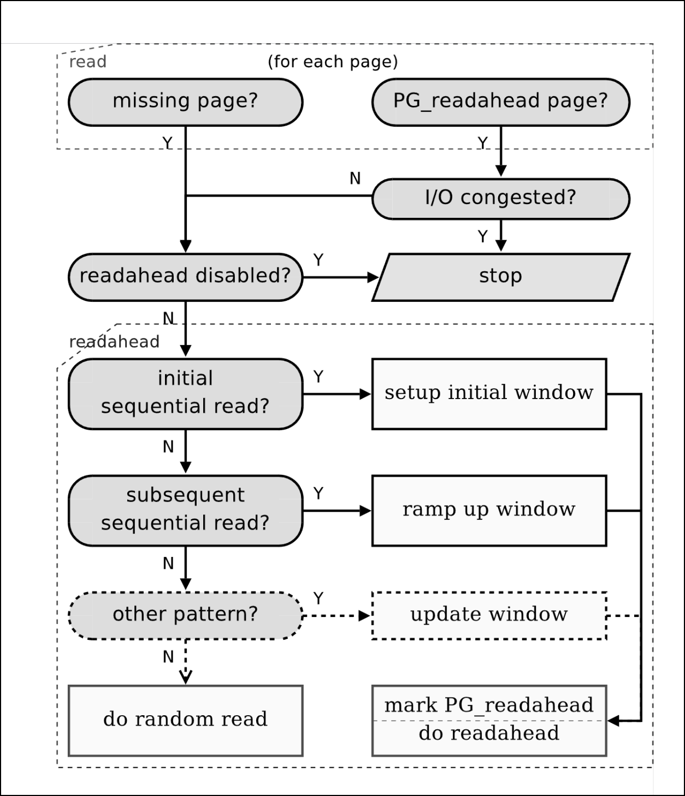

+++
title = "为 StarryOS 实现 readahead"
description = "记录为 StarryOS 实现 readahead 的开发日志"
date = 2025-12-29
updated = 2026-01-01
draft = false

[taxonomies]
categories = ["Devlog"]
tags = ["OS"]
[extra]
mermaid = true
+++

# 1. 背景和动机


这节由 Gemini 生成, 由我略作修缮。


## 1.1 现有 IO 机制的性能瓶颈

在 StarryOS 原有的文件系统架构中，针对大文件顺序读取场景（Sequential Read），存
在以下三个层面的显著性能瓶颈：

**1. 请求粒度过于细碎（Fine-grained I/O Submission）**

StarryOS 的缺页处理机制（Page Fault Handler）默认采用“按需调页”策略，即应用程序
每访问一页（4KB），才触发一次底层的 I/O 请求。这种 **逐页提交（Page-by-page
Submission）** 的方式没有利用块设备的批量处理能力。

对于 100MB 的文件读取，内核需要发起 25,600 次独立的 I/O 请求。这意味着文件系统
层与块设备驱动层之间存在数万次的函数调用与状态同步，造成了巨大的指令周期浪费。

**2. 软硬交互开销巨大 (Excessive Hardware Interaction Overhead)**

在 RISC-V QEMU/VirtIO 等虚拟化环境下，驱动层与设备的交互成本极高。每一次独立的
I/O 提交都需要执行 MMIO 写操作（Doorbell Kick）以通知设备，并产生一次硬件中断
（Interrupt）以通知完成。


StarryOS 还没有实现 interrupt IO


后果：在逐页读取模式下，频繁的 MMIO 操作会导致大量的 VM-Exit（虚拟机陷入），
Host 与 Guest 之间的上下文切换开销甚至可能超过了数据拷贝本身的耗时。这导致 CPU
在处理大量微小请求时陷入“颠簸（Thrashing）”状态。

**3. 串行化 I/O 模型导致的流水线停顿 (Pipeline Stalls in Serial I/O)**

原有的 I/O 处理路径是严格串行的“请求-等待-处理”模型。缺乏预取机制意味着数据请求
总是“被动”且“滞后”的。当应用程序处理当前数据页时，存储设备处于闲置状态；当应用
程序需要下一页数据时，必须发起新的 I/O 请求并等待数据到位。

后果：这种 “Stop-and-Wait” 模式无法利用 DMA（直接内存访问）的并行传输能力。CPU
的计算任务与 I/O 设备的数据传输任务在时间轴上互斥，导致系统无法建立有效的处理流
水线，I/O 延迟完全暴露在关键路径上。

## 1.2 预读机制的必要性与理论基础

在操作系统设计中，I/O 子系统的性能直接决定了数据密集型应用的执行效率。引入异步
预读（Asynchronous Readahead）机制并非单纯的功能堆砌，而是为了解决计算机体系结
构中存在的三个根本性矛盾。

**1. 弥合 CPU 与存储设备的速度鸿沟 (Bridging the Speed Gap)**

现代处理器的时钟频率通常在 GHz 级别（纳秒级周期），而存储设备（尤其是机械硬盘甚
至 NVMe SSD）的访问延迟通常在微秒甚至毫秒级别。两者之间存在着 3 到 6 个数量级的
速度差异。

无预读场景（同步阻塞）：当应用程序发生缺页（Page Fault）时，CPU 被迫停止流水线，
等待磁盘数据。对于 CPU 而言，这相当于法拉利跑车在每一个红绿灯路口都要熄火等待一
分钟。

预读场景：通过预测访问模式，操作系统提前将数据从慢速磁盘搬运至高速内存（Page
Cache）。当 CPU 需要数据时，直接从内存读取（命中 Cache），从而将 I/O 访问延迟从
毫秒级降低至纳秒级。

**2. 实现计算与 I/O 的并行流水线 (Parallelism & Pipelining)**

在同步读取模型中，系统处于 “计算——等待——计算——等待” 的串行模式（Stop-and-Wait）。
这种模式导致系统总线和 I/O 设备在 CPU 计算期间闲置，而在 I/O 传输期间 CPU 又闲
置，资源利用率极低。

预读机制的核心价值在于 掩盖延迟（Latency Hiding）。通过异步提交 I/O 请求：

- DMA（直接内存访问） 控制器负责在后台搬运数据。
- CPU 继续执行前台应用程序的计算逻辑。

这种 CPU 与 DMA 的物理并行，使得数据搬运的时间被有效的计算时间所“掩盖”，从而显
著提升了系统的整体吞吐量（Throughput）。

**3. 摊薄 I/O 栈的固定开销 (Amortizing I/O Stack Overhead)**

在 StarryOS 运行的 RISC-V 虚拟化环境（QEMU/VirtIO）中，发起一次 I/O 请求的**固
定开销**极其昂贵，主要包括：

- 软件层：系统调用上下文切换、VFS 路径解析、文件系统元数据查询。
- 驱动层：构建描述符链、内存屏障指令。
- 硬件层：MMIO 寄存器写入（导致 VM-Exit）、中断处理（导致流水线冲刷）。

如果采用按需调页（逐页读取），每读取 4KB 数据就要承担一次完整的固定开销，有效载
荷比（Payload Ratio） 极低。 将多个物理不连续的页面请求合并为一个大的 I/O 事务
（Transaction）。通过“批发”代替“零售”，极大地摊薄了每一次 I/O 操作的固定成本，
减少了昂贵的 MMIO 和中断次数。

**4. 利用空间局部性原理 (Exploiting Spatial Locality)**

绝大多数文件访问模式遵循空间局部性（Spatial Locality）原理，即一旦程序访问了文
件的某个位置，它很有可能在不久的将来访问其相邻的位置（如视频播放、日志分析、编
译器读取源码）。

预读机制正是基于这一原理，将大概率会被访问的数据提前加载。这不仅提升了缓存命中
率，还通过顺序 I/O 发挥了存储设备的最佳性能（减少机械磁盘的寻道时间或利用 SSD
的内部并行通道）。

# 2. 系统架构

## 2.1 StarrOS IO 读取架构图

对于从 ext4 磁盘读取文件的情景，StarryOS 的处理流程如下:


graph TD
    %% --- Layer 1: Syscall Interface ---
    subgraph "1. Syscall Layer (api/src/syscall)"
        SysRead[sys_read] -->|get_file_like| FileWrapper
    end

    %% --- Layer 2: VFS Wrapper ---
    subgraph "2. VFS Wrapper (api/src/file)"
        FileWrapper[File::read] -->|inner.read| AxFileRead
    end

    %% --- Layer 3: ArceOS High-Level VFS ---
    subgraph "3. ArceOS VFS (modules/axfs/highlevel)"
        AxFileRead[axfs::File::read] --> AxFileReadAt[read_at]
        AxFileReadAt --> BackendDispatch{FileBackend}
        
        BackendDispatch -->|Cached| CachedRead[CachedFile::read_at]
        BackendDispatch -->|Direct| FileNodeRead
        
        CachedRead -->|Page Miss| FileNodeRead[FileNode::read_at]
        CachedRead -->|Page Hit| ReturnData[Return Data from RAM]
    end

    %% --- Layer 4: File Node & Inode ---
    subgraph "4. FS Implementation (modules/axfs/fs/ext4)"
        FileNodeRead -->|FileNodeOps| InodeRead[Inode::read_at]
        InodeRead -->|Lock FS| LwExt4Read[lwext4_rust::Ext4Filesystem::read_at]
    end

    %% --- Layer 5: Ext4 Library (C/Rust Boundary) ---
    subgraph "5. lwext4 Library (External Crate)"
        LwExt4Read -->|FFI Call| C_Ext4Read[ext4_fread]
        C_Ext4Read -->|Block Request| C_BRead[ext4_block_read]
        C_BRead -->|Callback| FFI_Shim[Rust FFI Shim]
    end

    %% --- Layer 6: Block Device Glue ---
    subgraph "6. Block Device Glue (modules/axfs/fs/ext4)"
        FFI_Shim -->|BlockDevice Trait| Ext4DiskRead[Ext4Disk::read_blocks]
        Ext4DiskRead -->|AxBlockDevice| DriverRead[AxBlockDevice::read_block]
    end

    %% --- Layer 7: Driver Layer ---
    subgraph "7. Driver Layer (modules/axdriver)"
        DriverRead -->|VirtIoBlkDev| VirtIoRead[VirtIoBlk::read_block]
        VirtIoRead -->|VirtQueue| VirtQ_Add[virtq_add_buffer]
        VirtQ_Add -->|MMIO/PCI| Hardware[Hardware]
    end


```
+-------------------------------------------------------+
|                 用户应用 (User App)                    |
|                 调用 read(fd, buf)                     |
+-------------------------------------------------------+
                          |
                          v
+-------------------------------------------------------+
|                 VFS 层 (axfs::highlevel)               |
|           CachedFile::read_at (处理缓存逻辑)           |
+-------------------------------------------------------+
                          |
                          v
+-------------------------------------------------------+
|              具体文件系统层 (lwext4_rust)              |
|           InodeRef::read_at (解析 inode, block)        |
+-------------------------------------------------------+
                          |
                          v
+-------------------------------------------------------+
|              块设备接口层 (axdriver::BlockDevice)       |
|           AxBlockDevice::read_block (读写物理扇区)      |
+-------------------------------------------------------+
                          |
                          v
+-------------------------------------------------------+
|              具体驱动层 (axdriver::virtio)              |
|           VirtIoBlkDev::read_block (操作硬件寄存器)     |
+-------------------------------------------------------+
                          |
                          v
+-------------------------------------------------------+
|                    硬件 (QEMU/VirtIO)                  |
+-------------------------------------------------------+
```
## 2.2 层级简要解释

**系统调用层 (Syscall Layer)**

为用户应用提供 read 系统调用, 解析文件描述符 fd 获取 `FileLike` trait object, 这里
践行了 Unix 的 "一切皆文件" 哲学, 在我们的情境下, `FileLike` 的实现由 Starry
api 的 `file::fs::File` VFS 包装器提供。

**VFS 包装层 (VFS Wrapper)**

为上层提供 `FileLike` trait 实现, 并适配 POSIX 语义(如阻塞/非阻塞 IO 处理), 将
调用转发给内部的 ArceOS 文件 `axfs::File` 对象。非阻塞 IO 比如 socket 和 pipe,
而对于磁盘文件则按阻塞 IO 处理。

**ArceOS 文件系统层 (ArceOS VFS)**

从实现了 `FileNodeOps` trait 的具体文件系统中读取数据, 写回用户请求提供的
buffer 中, 并提供了两种写回模式:

- Direct: 直接将数据写回用户空间 (user buffer)
- Cached: 将数据拷贝到内核空间 (page cache) 作为缓存, 再写回用户空间。

**具体文件系统**

在我们的情景下, 文件系统是 ext4。提供 `FileNodeOps` 实现, 将逻辑转发给
lwext4_rust 库。lwext4_rust 的工作如下:

1. 解析 Ext4 文件系统结构（Inode, Extent Tree），计算逻辑偏移量对应的物理块号
   (LBA)。
2. 调用实现了 `BlockDevice` 的块设备接口获取数据。

**块设备适配层 (Block Device)**

运用了依赖倒置原则, 在 axfs 中实现了 lwext4_rust 库中定义的 `BlockDevice` trait,
并最终将块读取请求转发到驱动层。

**驱动层 (Driver Layer)**

组件: AxBlockDevice (即 VirtIoBlk), axdriver
职责: 构建 VirtIO 请求，写入 VirtQueue，通知硬件（通过 MMIO 或 PCI 寄存器）。

# 3. 核心设计

我们的 readahead 工作集中在 ArceOS VFS 层, 优化了 Cached 模式的缓存管理策略以及
IO 请求策略, 按照如下的顺序依次递进:

1. 启发式 readahead 窗口更新策略
2. 聚合 IO 请求, 实现批量 IO 读取
3. 引入 pending page, IO 读取任务重叠问题

## 3.1 启发式 (Heuristic) readahead

借鉴了 Linux 的实现, 根据用户的读取请求智能判断是否为顺序读取, 改变读取窗口

## 3.2 引入 bounce buffer 

## 3.3 pending page

# 4. 具体代码实现

---

To be continue...



`CachedFile` 的数据结构组成如下:

```rs
pub struct CachedFile {
    inner: Location,
    shared: Arc<CachedFileShared>,
    in_memory: bool,
    append_lock: RwLock<()>,
}
```

- `inner`: 底层 VFS 节点的位置句柄, 提供对底层文件系统的直接访问能力。
- `shared`: 共享缓存状态。
- `in_memory`: 标记该文件是否位于内存文件系统 (如 tmpfs) 中。
- `append_lock`: 追加写操作锁, 保证追加写的原子性。

其中 `CachedFileShared` 结构如下:

```rs
struct CachedFileShared {
    page_cache: Mutex<LruCache<u32, PageCache>>,
    evict_listeners: Mutex<LinkedList<EvictListenerAdapter>>,
}
```

这里的 `page_cache` 就是 LRU 页缓存池, 并通过 `evict_listeners`
提供页面驱逐通知机制。

### 读取流程

#### 1. 计算具体的读取字节区间

`read_at` 方法是 `CachedFile` 对外提供的读取入口, 根据 offset
( 起始读取字节偏移 )、文件总长度、 用户缓冲区剩余长度, 计算最终文件读取的字节区间。

提供从页表写回数据到用户空间, 并计算写入长度的闭包, 传入 `with_pages` 辅助函数。

```rs,name=arceos/modules/axfs/src/highlevel/file.rs
impl CachedFile {
    pub fn read_at(&self, dst: &mut impl BufMut, offset: u64) -> VfsResult<usize> {
        let len = self.inner.len()?;
        let end = (offset + dst.remaining_mut() as u64).min(len);
        if end <= offset {
            return Ok(0);
        }
        self.with_pages(
            offset..end,
            |_| Ok(0),
            |read, page, range| {
                let len = range.end - range.start;
                dst.write(&page.data()[range.start..range.end])?;
                Ok(read + len)
            },
        )
    }
```

```rs
    fn with_pages<T>(
        &self,
        range: Range<u64>,
        page_initial: impl FnOnce(&FileNode) -> VfsResult<T>,
        mut page_each: impl FnMut(T, &mut PageCache, Range<usize>) -> VfsResult<T>,
    ) -> VfsResult<T> {
        let file = self.inner.entry().as_file()?;
        let mut initial = page_initial(file)?;
        let start_page = (range.start / PAGE_SIZE as u64) as u32;
        let end_page = range.end.div_ceil(PAGE_SIZE as u64) as u32;
        let mut page_offset = (range.start % PAGE_SIZE as u64) as usize;
        for pn in start_page..end_page {
            let page_start = pn as u64 * PAGE_SIZE as u64;

            let mut guard = self.shared.page_cache.lock();
            let page = self.page_or_insert(file, &mut guard, pn)?.0;

            initial = page_each(
                initial,
                page,
                page_offset..(range.end - page_start).min(PAGE_SIZE as u64) as usize,
            )?;
            page_offset = 0;
        }

        Ok(initial)
    }
}
```

## readahead 策略


# dev log

## 初步实现

将论文描述的预读逻辑添加到 arceos 中 ([commit](https://github.com/uchouT/arceos/commit/1750969021315c9f75a8c5f467d05f9e5a242f58)),
但是经过测试，读取速度反而下降了非常多。通过日志 debug 发现，问题的根源是 async
readahead 发起后，没有立刻开始执行，而是要一段时间后 CPU 时钟中断后才开始，但此
时应用读取窗口已经消费完了，会遇到本应由 async readahead 填充的 page，造成
cache miss 从而触发预读逻辑；等 async readahead 任务开始执行时，读取的部分是严
重重叠的。

解决办法是在 async readahead 提交后，立刻让出 CPU 控制权，让 async
readahead 先运行：

```rust,linenos,linenostart=972,name=modules/axfs/src/highlevel/file.rs
                axtask::spawn(move || {
                    // error!(
                    //     "async prefetch launched, pn={} size={} pg_flag={}",
                    //     start_pn, size, pg_readahead_offset
                    // );
                    readahead::async_prefetch(
                        shared,
                        file,
                        in_memory,
                        start_pn,
                        size,
                        pg_readahead_offset,
                    );
                });
                // yield to let async prefetch run earlier
                axtask::yield_now();
```

此时速度终于回到正常水平，但提升效果远没有达到预期。

_TODO: 增加测试数据_

## 问题探索

观察日志发现，在进入顺序读取时，还是会有 cache
miss 发生，而理想情况下这是不应当出现的。

经过思考，原因应该是：如果应用程序读取请求非常快，那么 readahead
(producer) 的 cache 生成流水线会立刻被应用程序 (consumer) 追上，从而造成 cache
miss，然后又发起 sync readahead，这样就与先前发起的 async
readahead 冲突了，造成了大量 CPU 资源浪费。

在这条 [commit](https://github.com/uchouT/arceos/commit/6143c3b9cf720ff166e17fa29e10c67140f8fd67) 所
在的时间点中，async readahead 的 cache produce 策略是整块读取，然后统一添加到
LruCache 中, 为了减小 LrchCache 的锁竞争。既然问题是 readahead produce 的速度太
慢了，那么很自然的解决办法是让读到的数据尽可能快的添加到 LruCache 中，于是我将
async readahead 的策略从 batch 改为了 streaming: [feat(fs): change async
prefetch cache loading from batch to stream](https://github.com/uchouT/arceos/commit/3f967aa2c0f1a731ce022a1097b979571e8cf156).

很可惜，经过测试速度不增反降，不过仔细想想就知道，上面的那个做法相当愚蠢：IO 再
快，也不可能比 CPU、内存更快，所以在 consumer 消费非常快的情况下，追上流水线造
成 sync readahead 和 async readahead 重叠几乎是必然的，将异步预读改为逐 page 流
式处理反倒会引入锁竞争开销。

因此现在的解决方向是：

1. 尽可能加快 async readahead
2. 解决不可避免的 window overlap 冲突

## bounce buffer 加快 io_submit

对于第一个方向，现在的 `io_submit` 策略是逐 pn 发送 `file.read_at`
请求，但是一次 `file.read_at` 其实就是一次 io 请求：

```rs,linenos,linenostart=196,name=modules/axfs/src/highlevel/file/readahead.rs
for &pn in &pages_to_read {
        let mut page = PageCache::new()?;

        if pn == async_pg_pn {
            page.pg_readahead = true;
        }

        if in_memory {
            page.data().fill(0);
        } else {
            file.read_at(page.data(), pn as u64 * PAGE_SIZE as u64)?;
        }
        loaded_pages.push((pn, page));
    }

```

而 readahead 期望的是发送一次性大块 (big
chunk) 请求，从而减小硬件的读取开销，比如磁盘寻道。因此现在的实现不符合要求，一次 io
submit 实际上仍然有多次 io 请求。现在需要将多次 io 请求合并。

根据 `FileNodeOps` 的 trait，目前的 IO 读取是将 offset 开始的数据填满缓冲区：

```rust
pub trait FileNodeOps: NodeOps + Pollable {
    /// Reads a number of bytes starting from a given offset.
    fn read_at(&self, buf: &mut [u8], offset: u64) -> VfsResult<usize>;
    // ...
}
```

因此如果要利用现有接口实现 big chunk 读取，必须引入一个中间缓冲区 bounce
buffer, 将 big
chunk 一次性读取到缓冲区中，然后再拷贝到每个 page 对应的地址中，代码类似如下:

```rust
let mut bounce_buffer = vec![0u8; pages_to_read.len() * PAGE_SIZE];
// big chunck IO request
file.read_at(bounce_buffer, start_pn as u64 * PAGE_SIZE as u64)?;


for &pn in &pages_to_read {
	// desigenate to each page
}
```

用中间缓冲区实现了 big
chunk 读取之后 ([commit](https://github.com/uchouT/arceos/commit/1abc31bbfb3b20ae647a0c295fa33c6f793563f5)) 可以看到速度确实快了很多：

```
seq_read_test: (g=0): rw=read, bs=(R) 4096B-4096B, (W) 4096B-4096B, (T) 4096B-4096B, ioengine=psync, iodepth=1
fio-3.39
Starting 1 process
Jobs: 1 (f=1)
seq_read_test: (groupid=0, jobs=1): err= 0: pid=10583: Wed Dec 10 19:21:33 2025
  read: IOPS=27.0k, BW=105MiB/s (110MB/s)(128MiB/1215msec)
    clat (usec): min=6, max=3255, avg=33.10, stdev=79.29
     lat (usec): min=7, max=3255, avg=33.59, stdev=79.35
    clat percentiles (usec):
     |  1.00th=[    8],  5.00th=[    8], 10.00th=[    8], 20.00th=[    8],
     | 30.00th=[    8], 40.00th=[    8], 50.00th=[    8], 60.00th=[    8],
     | 70.00th=[    9], 80.00th=[   18], 90.00th=[   82], 95.00th=[  202],
     | 99.00th=[  396], 99.50th=[  424], 99.90th=[  537], 99.95th=[  619],
     | 99.99th=[ 1221]
   bw (  KiB/s): min=106519, max=109398, per=100.00%, avg=107958.50, stdev=2035.76, samples=2
   iops        : min=26629, max=27349, avg=26989.00, stdev=509.12, samples=2
  lat (usec)   : 10=76.94%, 20=7.84%, 50=2.09%, 100=3.81%, 250=5.90%
  lat (usec)   : 500=3.27%, 750=0.12%, 1000=0.01%
  lat (msec)   : 2=0.01%, 4=0.01%
  cpu          : usr=16.95%, sys=82.96%, ctx=0, majf=0, minf=0
  IO depths    : 1=100.0%, 2=0.0%, 4=0.0%, 8=0.0%, 16=0.0%, 32=0.0%, >=64=0.0%
     submit    : 0=0.0%, 4=100.0%, 8=0.0%, 16=0.0%, 32=0.0%, 64=0.0%, >=64=0.0%
     complete  : 0=0.0%, 4=100.0%, 8=0.0%, 16=0.0%, 32=0.0%, 64=0.0%, >=64=0.0%
     issued rwts: total=32768,0,0,0 short=0,0,0,0 dropped=0,0,0,0
     latency   : target=0, window=0, percentile=100.00%, depth=1

Run status group 0 (all jobs):
   READ: bw=105MiB/s (110MB/s), 105MiB/s-105MiB/s (110MB/s-110MB/s), io=128MiB (134MB), run=1215-1215msec
```

但是这样会引入不必要的拷贝，为什么不能在 IO 设备搬运数据时，直接通过 DMA 将数据
搬运到每个 page 所在的位置呢？查阅相关资料，发现了
[scatter - gather](<https://en.wikipedia.org/wiki/Gather/scatter_(vector_addressing)>),
这能够在一次调用内同时处理多个缓冲区，这正是消除中间缓冲区所必须的。

检查 StarryOS api 的时候发现了 `sys_readv`
这个系统调用，它能做到内核到用户空间的 _scatter - gather_：

```rust
// StarryOS/api/src/syscall/fs/io.rs

pub fn sys_readv(fd: i32, iov: *const IoVec, iovcnt: usize) -> AxResult<isize> {
    debug!("sys_readv <= fd: {fd}, iovcnt: {iovcnt}");
    let f = get_file_like(fd)?;
    f.read(&mut IoVectorBuf::new(iov, iovcnt)?.into_io().into())
        .map(|n| n as _)
}
```

不过这与我们的目的没有任何关系：我们的目的是实现从 IO 设备到内核态 page cache 的
_scatter - gather_。

很可惜，经过初步尝试，要在现有的接口基础上实现 scatter -
gather，需要大量重构，还要修改驱动的代码。这一步暂时先搁置，在未来实现。

不过我们可以进一步优化实现：将 bounce_buffer 复用，从而减少 vec 的分配销毁开销：

```diff
 struct CachedFileShared {
     page_cache: Mutex<LruCache<u32, PageCache>>,
+    bounce_buffer: Mutex<Vec<u8>>,
     evict_listeners: Mutex<LinkedList<EvictListenerAdapter>>,
 }
```

可以看到速度确实又进一步提升了：

```
starry:~# time dd if=/largefile of=/dev/null bs=1M count=65536
128+0 records in
128+0 records out
134217728 bytes (128.0MB) copied, 0.873597 seconds, 146.5MB/s
real    0m 0.91s
user    0m 0.00s
sys     0m 0.1717986s
starry:~# time dd if=/largefile of=/dev/null bs=1M count=65536
128+0 records in
128+0 records out
134217728 bytes (128.0MB) copied, 0.888497 seconds, 144.1MB/s
real    0m 0.93s
user    0m 0.00s
sys     0m 0.1717986s
starry:~# time dd if=/largefile of=/dev/null bs=1M count=65536
128+0 records in
128+0 records out
134217728 bytes (128.0MB) copied, 0.894203 seconds, 143.1MB/s
real    0m 0.93s
user    0m 0.00s
sys     0m 0.1717986s
```

完整的实现在
[feat(fs): introduce bounce buffer cache](https://github.com/uchouT/arceos/commit/bc8ceb051908e10dce50af738417d8dc5abd8c4c)

## 引入 pending page

对于第二个方向, 思路是在 page cache 中引入 pending page flag，在 async
readahead 中，先插入到 lrucache 中，这样消费窗口追上后，不会立刻判定为 cache
miss 从而执行重复的预读，而是等待异步预读完成，将 pending page
flag 消除，然后填入想要的数据。

这部分的初步实现由同伴 [aster](https://github.com/Aster-amellus)
完成：[perf(fs):optimize readahead strategy for mixed workload](https://github.com/Aster-amellus/arceos/commit/3e32c21b8d6a3a263df9c7a3b32020c977c3043a)

我在此基础上修复了遇到 pending page 后，如果这个 pending page 带 pg_readahead
flag 不会触发 async
readahead 的问题。以及优化了 in_memory 情况下 io_submit 逻辑。

不过现在发现了一个残酷的真相：async
readahead 并不会提高读取的性能，现在的性能提升主要来自大块读取优化，以及启发式窗口更新。

同伴的实现中，修改了 async readahead 的触发条件, 用户请求窗口过大和过小都不会触
发异步预读逻辑。而在测验中，不触发异步预读逻辑的情况下，速度提升非常巨大；而触
发异步预读逻辑的情况下，速度提升相对较小 ( 这里比较的对象是同样开启异步预读，但
是没有引入 pending page )。而如果直接关闭所有的异步预读，所有情况都能获得大幅性
能提升。

可见，在异步预读实现纵向对比中，加入 pending page flag 确实可以提高性能，但是横
向对比不开启异步预读的情况，异步预读的效果是削弱性能的。

主要原因是，当前 StarryOS 和 arceos 中，切换开销非常大，要大于 io 请求的开销，
而这在现实情况中不是很常见，因此进一步探索 starryOS 的调度机制也是我们未来的工
作之一。

# 未来工作计划

引入中断驱动 I/O (Interrupt-driven I/O)： 目前 StarryOS 的 VirtIO 驱动仍采用轮
询/同步模式，虽然预读机制通过批处理减少了提交端的开销，但 I/O 完成端的轮询依然
占用 CPU 周期。未来计划实现基于中断的异步通知机制，配合 Waker/Poll 异步原语，进
一步实现真正的零阻塞 I/O。

Scatter - gather
