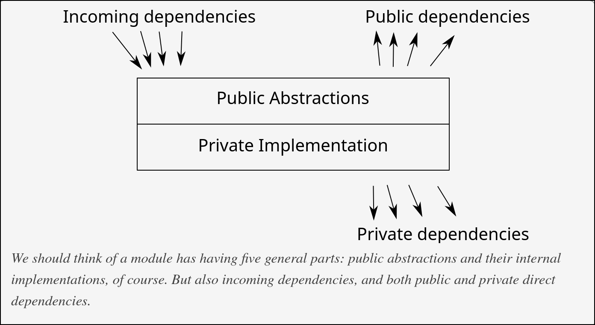

+++
title = "ted kaminski blog reading"
description = "ted kaminski blog 系列阅读笔记"
date = 2026-04-06
draft = false

[taxonomies]
categories = ["Learning"]
tags = ["software design", "programming"]
+++

记录读了 ted kaminski 的 [系列博客](https://www.tedinski.com/archive/) 的思考。

## 软件的演化

> _Definition:_ **The standard algorithm**
>
> 1. Write stuff
> 2. Fix it
> 3. Don't forget step 2

大型软件的结构不是一开始就设计好的，而是迭代出来的。设计必须迭代，因为**在开始时你不知道自己不知道什么**。初期的目标不是做出最好的设计，而是最快速地暴露错误的假设。

为了让软件易于迭代，需要好的 system boundary。Boundary 上的修改是破坏性的（影响你控制不了的外部用户），而 boundary 内部的重构成本小得多。因此 boundary 的设计是软件架构中最关键的决策——它决定了哪些部分可以自由演化，哪些部分被冻结。

但 boundary 必须结合实际需求引入。过早引入 boundary 会冻结你还没理解清楚的设计；错误的 boundary 比没有 boundary 更糟，因为它既阻止了迭代，又没有提供正确的约束。当 boundary 还模糊时，用巫师模式快速探索，不要陷入过度设计。等理解清楚了再固化为工程代码。

UML 的失败就是试图跳过迭代循环——假设可以在实现之前完成全部设计。但是没有人能跳过它。

## System Boundary

> "It's the inability to make breaking changes because you have (or are acting like you have) external users to support that really defines a boundary."

### 架构的本质：管理 " 不可知 " 的蔓延

System boundary 将系统分隔出层级，是层级之间的契约。各层级内部有自己的*约束*——约定什么能做，什么不能做。有了约束，层级之间就可以进行假设和推理。

**架构的核心工作，是在系统规模扩大的过程中，阻止 " 什么都不能假设 " 蔓延到每一个角落。**

没有架构约束的系统，每个模块都能做任何事，依赖任何其他模块。改任何地方都不安全，因为你不知道连锁反应在哪里结束——这就是 " 大泥球 "。

好的架构通过刻意施加约束，把系统划分成若干个 " 在这里，你可以知道某些事 " 的区域，让局部推理成为可能。

**约束不是设计的妥协，而是设计的目的本身。**

## 设计 System Boundary

### 类型设计

*这里的 " 易于扩展 " 针对的是类型的使用者（而非实现者）。*

| 类型                      | 使用者易于扩展        | 破坏性扩展           | 换来的性质                |
| ----------------------- | -------------- | --------------- | -------------------- |
| Data（pub fields）        | 方法（利用公开字段写新函数） | 变体（加字段破坏所有使用者）  | 使用者自由度最大             |
| Object（trait/interface） | 变体（实现新类型）      | 方法（加新方法破坏所有实现者） | 实现可替换                |
| ADT（sealed, 非 pub）      | 都不能            | 都不能             | **实现者自由度最大**，内部可随意改变 |

**直觉：优先 ADT，property 最强。** 用 ADT + 组合实现复用。只在确实需要外部扩展时，再根据扩展方向选择 data（需要加操作）或 object（需要加变体）。matklad 的 [Code Smell: Concrete Abstraction](https://matklad.github.io/2020/08/15/concrete-abstraction.html) 中的观点: 直到处理分发的方法出现, 才抽象出 trait, 也是类似的思路。

**Variance 影响演化方向：** 参数收窄是破坏性的（调用者传的值可能不再合法），返回值放宽是破坏性的（调用者对返回值的假设可能不再成立）。设计 boundary API 时，要想清楚每个位置的变化方向。

### 依赖管理



模块的五个维度都应该尽量小：

- 更少的**公开依赖** → 使用者认知负担小
- 更少的**私有依赖** → 开发者认知负担小
- 更小的**实现** → 更容易理解
- 更少的**公开抽象** → 更容易学习
- 更少的**入向依赖** → 更容易演化

但这五个目标**互相制约**：

- 减少公开依赖 → 可能需要引入更多抽象层（增大公开抽象）
- 减少私有依赖 → 可能需要复制代码（增大实现）
- 减少公开抽象 → 可能需要拆成更多模块（增加模块间复杂度）
- 减少实现 → 可能需要更多模块（增加依赖关系）

**反依赖设计**：最重要的问题不是 " 暴露什么 "，而是 " 不暴露什么 "、" 不依赖什么 "、" 什么不能依赖我 "。

**公开依赖传染**：暴露在 boundary API 中的类型也成为 boundary。随手加一个 getter 暴露内部类型，影响比你以为的大得多。

### 数据解耦

数据可以作为模块之间的接口——协议、IR、ViewModel 都是这个思路。

**行动具象化**：把状态变更表示为数据类型（event enum）+ 独立的执行器/interpreter。

## Test

### 测试的两个作用

1. **保证 boundary API 的功能和形状正确**——boundary 上的测试维护成本接近零，因为 boundary 本身就不应该随意变化
2. **开发期间的快速验证工具**——帮助确认当前实现是否符合预期

### 核心原则

- **先有推理，才有测试。** 不是通过测试来推理出设计，而是推理出设计后用测试来固定它。
- **Sans-IO 的本质是逻辑和执行的解耦。** 核心逻辑变成纯函数/状态机，无需 mock 就能测试。
- **Property test 优于 example-based unit test。** 一个 property test 可以替代多个手写用例，覆盖面更广，且不与实现细节耦合。
- **test at system boundary.** 只关心 boundary 的公共行为，不关心内部实现。重构内部时这些测试不会碎。
- **在 Rust 实践中，把集成测试统一到一个 test-suite crate 可以显著加快编译。** 避免每个测试文件都重新链接所有依赖库。

### Mock 的问题

Mock 无法提供**双向保证**——模拟的行为不保证是真实的行为。你 mock 了数据库返回 0，但真实数据库在那个场景返回 NULL，测试全绿但生产环境爆炸。

在内部代码中追求 mock 还会把测试与实现耦合：重构内部时 mock 跟着全碎，测试从安全网变成障碍。

### 测试的生命周期

测试是迭代的，和代码一样有生命周期：

- **开发期**：对具体实现写单元测试 → 有用，快速反馈
- **设计稳定后**：同样的内部测试 → 可能成为妨碍重构的负担

正确做法：

- 开发期用内部测试获得快速反馈
- 设计稳定后，把测试迁移到 boundary（或接受内部测试被删掉/重写）
- boundary 上的测试长期保留——它们不会因为内部重构而碎

### 什么时候写测试

边界还没清晰时，不应该设立大量测试——**边界的设计就是推理的过程，推理先于测试。**

```
你知道 boundary 在哪吗？
├── 是（spec/已有 trait/外部用户）
│   → 直接设计 Type → 写测试 → 实现
└── 不确定
    ├── 硬 boundary？（影响你控制不了的东西）
    │   ├── 是 → 必须先推理清楚，不能巫师模式
    │   └── 不是 → 巫师模式探索，之后自由重构
    └── 完全未知的问题域
        → 写 spike/原型 → 理解后丢掉 → 重新设计 boundary
```

识别到 boundary 后的流程：设计类型 → 设计 API → 写 boundary 测试 → 实现 → property test 加固。

关于类型设计: [Rust type driven development](https://www.ruggero.io/blog/rust_type_driven_development_guide/)
