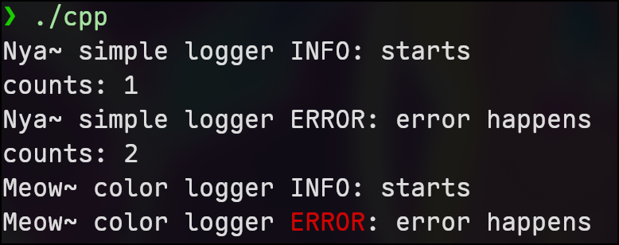

+++
title = "用 c 手搓 c++ 和 rust 两种 vtable"
description = "用 C 手写 C++ 嵌入式 vtable 与 Rust 胖指针 vtable, 对比两种多态实现在内存布局、性能、扩展性上的取舍."
date = 2026-05-12
draft = false

[taxonomies]
categories = ["Learning"]
tags = ["rust", "programming", "vtable", "oop", "c", "cpp"]
+++

## Intro

最近在读 QEMU 源码, 其中的 QOM (QEMU Object Model) 是一个用 c 实现的面向对象系统. 这让我想试着自己搓 vtable 来感受一下原生支持多态的语言其底层的实现. 毕竟在计算机世界中没有魔法, 所有的控制流, 函数调用, 多态, 无非是 [PC](https://en.wikipedia.org/wiki/Program_counter) 寄存器的地址修改.

而且这也能与我先前对 rust dyn compatibility 的解读的[文章](../rust-dyn-compatibility)对应.

在本文中我将写两种 vtable:

1. 嵌入式 vtable, cpp 采用这种, 下文用 cpp style vtable 称呼.
2. 胖指针 vtable, rust 采用这种, 下文用 rust style vtable 称呼.

来实现一个简单的控制台 Logger.


例子是高度简化的, 并且纯栈上分发, 也没有资源需要释放. 因此 drop, size, align 等我就不放到 vtable 中了.

(主要还是因为懒


---

## cpp style vtable

### define vtable

先来定义虚函数表, 这也就是我们需要动态分发的方法:

```c
typedef struct Logger Logger;

typedef enum {
        INFO,
        ERROR,
} Level;

typedef struct {
        const char *(*name)(Logger *self);
        void (*log)(Logger *self, Level level, const char *msg);
        void (*info)(Logger *self, const char *msg);
        void (*error)(Logger *self, const char *msg);
} LoggerVtable;
```

这里的 `LoggerVtable` 中包含了四个函数指针, 对应的即是 cpp 中的虚函数. 注意 c 的 "declaration mimics use" 的声明方式, 这个结构体实际有四个字段,分别: `name`, `log`, `info`, `error`, 每个都是指针类型.

---

### base class and dispatch

先来定义基类:

```c
struct Logger {
        const LoggerVtable *vtable;
};
```

这个就是基类, 里面包含 vtable 字段, 这也是后面方法分发的入口. 在 cpp 能通过继承实现字段复用, 这里需要复用的字段也是直接定义在这个基类中:

```c
struct Logger {
        const LoggerVtable *vtable;

        // 复用的字段, 我随便举个例子
        const char *prefix;
};
```

然后来提供辅助分发函数, 这就是后续类型擦除后多态函数调用的入口:

```c
static inline const char *logger_name(Logger *lg)
{
        return lg->vtable->name(lg);
}
static inline void logger_log(Logger *lg, Level level, const char *msg)
{
        lg->vtable->log(lg, level, msg);
}
static inline void logger_info(Logger *lg, const char *msg)
{
        lg->vtable->info(lg, msg);
}
static inline void logger_error(Logger *lg, const char *msg)
{
        lg->vtable->error(lg, msg);
}
```

可见, 这些辅助函数内部只是把函数调用转发到 vtable 的函数指针中.

为什么 vtable 中的每个函数指针, 以及辅助分发函数都需要有 `Logger` 基类作为函数参数? 因为届时子类在多态时会类型擦除成基类, 基类持有 vtable, 可以完成方法动态分发. 作为入口其必须作为分发函数的参数; 而作为 vtable 的参数, 一方面是基类可能还有其他字段, 在提供实现的时候需要用到, 另一方面实现中可能需要调用其他虚方法, 这需要借助基类作为 vtable 跳板。因此 vtable 作为「函数接口定义」必须把基类作为 context 接入.

---

### default implementations

在 cpp 中父类可以提供默认实现, 子类可以选择是否覆盖. 在我们的例子中, 其实就是提供一个默认的, 与 vtable 函数指针接口签名对应的函数入口:

```c
static void default_logger_info(Logger *lg, const char *msg)
{
        lg->vtable->log(lg, INFO, msg);
}
static void default_logger_error(Logger *lg, const char *msg)
{
        lg->vtable->log(lg, ERROR, msg);
}
```

提供了通过调用 `log` 方法的 `info`, `error` 默认实现.

注意, 函数签名必须和 vtable 中的一致, 否则在构造 vtable 的时候无法用这些函数指针.

至此, 接口写完了, 其模拟的 cpp 代码大致如下:

```cpp
enum class Level { INFO, ERROR };

class Logger {
public:
        // shared fields
        const char *prefix;

        virtual ~Logger() = default;

        virtual const char *name() const = 0;
        virtual void log(Level level, const char *msg) = 0;

        virtual void info(const char *msg) { log(Level::INFO, msg); }
        virtual void error(const char *msg) { log(Level::ERROR, msg); }
};
```

---

### subclass implementations

接下来可以实现一个简单的子类:

```c
typedef struct {
        Logger base;
        int count;
} SimpleLogger;
```

这里将 `Logger` 基类直接嵌入到字段中, 这也是为什么这类 vtable 叫做「嵌入式 vtable」. 并且需要注意的是, 必须将基类嵌入到第一个字段, 否则之后需要用到的类型转换不能自动发生。

之后提供实现, 注意函数签名同样需要和 vtable 对齐, 原因和上面的默认实现一模一样, 它们最终都需要构造成 vtable.

这里只提供必须实现的两个实现, `info` 和 `error` 走默认实现:

```c
static const char *simple_logger_name(Logger *_lg)
{
        return "simple logger";
}

static void simple_logger_log(Logger *lg, Level level, const char *msg)
{
        SimpleLogger *c = (SimpleLogger *)lg;
        c->count += 1;

        const char *level_msg;
        switch (level) {
        case INFO:
                level_msg = "INFO";
                break;
        case ERROR:
                level_msg = "ERROR";
                break;
        }
        printf("%s %s %s: %s\ncounts: %d\n", lg->prefix, logger_name(lg),
               level_msg, msg, c->count);
}
```

接着构造 vtable:

```c
static const LoggerVtable SIMPLE_LOGGER_VT = {
        .name = simple_logger_name, // 指向我们的实现
        .log = simple_logger_log,

        .info = default_logger_info, // 采用基类默认实现
        .error = default_logger_error,
};
```

在构造 `SimpleLogger` 实例的时候将 vtable 字段用刚刚固定到全局静态区的 `SIMPLE_LOGGER_VT`:

```c
SimpleLogger new_simple_logger(const char *prefix)
{
        SimpleLogger lg = { .base = { .vtable = &SIMPLE_LOGGER_VT,
                                      .prefix = prefix },
                            .count = 0 };
        return lg;
}
```

接下来再为了体现多态, 再来实现一个 `ColorLogger`, 报 error 时会把 `ERROR` 标红:

```c
typedef struct {
        Logger base;
} ColorLogger;

static const char *color_logger_name(Logger *_lg)
{
        return "color logger";
}

static void color_logger_log(Logger *lg, Level level, const char *msg)
{
        const char *level_msg;
        switch (level) {
        case INFO:
                level_msg = "INFO";
                break;
        case ERROR:
                level_msg = "ERROR";
                break;
        }
        printf("%s %s %s: %s\n", lg->prefix, logger_name(lg), level_msg, msg);
}

// override
static void color_logger_error(Logger *lg, const char *msg)
{
        printf("%s %s \033[0;31mERROR\033[0m: %s\n", lg->prefix,
               logger_name(lg), msg);
}

static const LoggerVtable COLOR_LOGGER_VT = {
        .name = color_logger_name,
        .log = color_logger_log,
        .info = default_logger_info,
        // 用重载的函数指针替换默认实现的函数指针, 这就是重载的本质
        .error = color_logger_error,
};

ColorLogger new_color_logger(const char *prefix)
{
        ColorLogger lg = {
                .base = { .vtable = &COLOR_LOGGER_VT, .prefix = prefix },
        };
        return lg;
}
```

至此, 两个子类实现都完成了, 模拟的 cpp 代码如下:

```cpp
static const char *level_str(Level l) {
        switch (l) {
        case Level::INFO:  return "INFO";
        case Level::ERROR: return "ERROR";
        }
        return "";  // unreachable
}

class SimpleLogger : public Logger {
        int count = 0;
public:
        const char *name() const override { return "simple logger"; }

        void log(Level level, const char *msg) override {
                ++count;
                std::printf("%s %s %s: %s\ncounts: %d\n",
                            prefix, name(), level_str(level), msg, count);
        }

        // info 和 error 走默认实现
};

class ColorLogger : public Logger {
public:
        const char *name() const override { return "color logger"; }

        void log(Level level, const char *msg) override {
                std::printf("%s %s %s: %s\n",
                            prefix, name(), level_str(level), msg);
        }

        // 覆盖默认实现 —— 对应 color_logger_error
        void error(const char *msg) override {
                std::printf("%s %s \033[0;31mERROR\033[0m: %s\n",
                            prefix, name(), msg);
        }
        // info 仍然走基类默认
};
```

---

### usage

```c
int main()
{
        SimpleLogger sp = new_simple_logger("Nya~");
        ColorLogger cl = new_color_logger("Meow~");

        // 栈上动态分发, 类型擦除
        Logger *logger[] = {
                (Logger *)&sp,
                (Logger *)&cl,
        };

        for (int i = 0; i < 2; ++i) {
                logger_info(logger[i], "starts");
                logger_error(logger[i], "error happens");
        }
}
```

编译后运行输出:



完整的源码在这里可以访问: [vtable_cpp.c](./vtable_cpp.c)

---

## rust style vtable

### define vtable

现在来模拟 rust 的 fat pointer. 首先还是定义 vtable:

```c
typedef enum {
        INFO,
        ERROR,
} Level;

typedef struct {
        const char *(*name)(void *self);
        void (*log)(void *self, Level level, const char *msg);
        void (*info)(void *self, const char *msg);
        void (*error)(void *self, const char *msg);
} LoggerVtable;
```

这里的函数指针签名需要用 `void *` 类型擦除指针. 因为 rust style 根本没有基类的概念, 具体见后文.

---

### fat pointer

然后就是 fat pointer 定义:

```c
typedef struct {
        void *data;
        const LoggerVtable *vtable;
} DynLogger;
```

fat pointer 中有两个地址, 一个指向原始数据, 一个指向 vtable。

而之后的动态分发如下:

```c
static const char *logger_name(void *self)
{
        DynLogger *lg = self;
        return lg->vtable->name(lg->data);
}
static void logger_log(void *self, Level level, const char *msg)
{
        DynLogger *lg = self;
        lg->vtable->log(lg->data, level, msg);
}
static void logger_info(void *self, const char *msg)
{
        DynLogger *lg = self;
        lg->vtable->info(lg->data, msg);
}
static void logger_error(void *self, const char *msg)
{
        DynLogger *lg = self;
        lg->vtable->error(lg->data, msg);
}
```

fat pointer 通过 vtable 找到函数指针, 然后把 `data` 地址作为函数参数传入. `data` 和 vtable 的参数都是擦除类型的指针 `void *`, 因此正好对齐.


这里实际上模拟的, 是 rust 编译器为 dyn-compatible (object-safe) 的 trait 隐式合成的"`dyn Trait` 自身实现该 trait"那一层桥接, 概念上等价于:

```rust
// 概念示意 —— 编译器合成
impl Logger for dyn Logger {
    /* 每个方法都转发到 vtable */
}
```

为了让分发函数和 vtable 中的 impl 函数指针签名一致, 上面用 c 模拟的代码也用 `void *self` 作为签名, 虽然实际中直接传 `DynLogger` 更直接。


---

### default implementations

这里提供默认实现的方式与上面的 cpp style vtable 有些不同, 不再是提供一个默认实现的函数指针. 因为现在的 vtable 函数接口签名没有基类, 只有一个擦除了类型的裸指针 `void *self`, 此时如果在默认实现中需要访问 vtable 其他函数接口, 就没有入口了.

而 rust 面对这种情况的做法是单态化 [Monomorphization](https://en.wikipedia.org/wiki/Monomorphization): 编译器为 `dyn Trait` 生成 vtable 时, 会把每个用到的默认方法**按具体类型单态化**一份, 该具体类型的 vtable 槽位指向这一份特化代码; 特化体里 `self.log(...)` 因此可以静态分派到该类型的 `log` impl, 不必再走一次 vtable. 下面用 c 宏来模拟这种"按 TYPE 生成一份默认实现"的样板:

```c
#define DEFAULT_IMPL_INFO(TYPE, LOG_FN)                           \
        static void TYPE##_info_impl(void *self, const char *msg) \
        {                                                         \
                LOG_FN(self, INFO, msg);                          \
        }

#define DEFAULT_IMPL_ERROR(TYPE, LOG_FN)                           \
        static void TYPE##_error_impl(void *self, const char *msg) \
        {                                                          \
                LOG_FN(self, ERROR, msg);                          \
        }
```

至此接口写完了, 其模拟的 rust 代码如下:

```rust
enum Level {
    Info,
    Error,
}

trait Logger {
    fn name(&self) -> &str;
    fn log(&mut self, level: Level, msg: &str);

    // 提供了默认实现
    fn info(&mut self, msg: &str) {
        self.log(Level::Info, msg);
    }
    fn error(&mut self, msg: &str) {
        self.log(Level::Error, msg);
    }
}
```

---

### trait implementations

接下来还是提供两种 logger 实现, 首先是 `SimpleLogger`:

```c
typedef struct {
        int count;
        const char *prefix;
} SimpleLogger;

// impl Logger for SimpleLogger
static const char *simple_logger_name_impl(void *self)
{
        return "simple logger";
}

static void simple_logger_log_impl(void *self, Level level, const char *msg)
{
        SimpleLogger *lg = self;
        lg->count += 1;

        const char *level_msg;
        switch (level) {
        case INFO:
                level_msg = "INFO";
                break;
        case ERROR:
                level_msg = "ERROR";
                break;
        }

        // self-call 是静态的, 不走 vtable
        printf("%s %s %s: %s\ncounts: %d\n", lg->prefix,
               simple_logger_name_impl(lg), level_msg, msg, lg->count);
}
```

这里的 impl 函数签名需要和 vtable 中定义的函数指针签名一致. 默认实现需要利用刚刚定义的辅助宏来模拟单态化:

```c
// 生成 simple_logger_info_impl 函数
DEFAULT_IMPL_INFO(simple_logger, simple_logger_log_impl)

// 生成 simple_logger_error_impl 函数
DEFAULT_IMPL_ERROR(simple_logger, simple_logger_log_impl)
```

接着创建 vtable, 放到全局静态段中:

```c
const static LoggerVtable SIMPLE_LOGGER_VT = {
        .name = simple_logger_name_impl,
        .log = simple_logger_log_impl,

        // 下面两个默认实现是由宏生成的
        .info = simple_logger_info_impl,
        .error = simple_logger_error_impl,
};
```

然后是 `ColorLogger`:

```c
typedef struct {
        const char *prefix;
} ColorLogger;

static const char *color_logger_name_impl(void *self)
{
        return "color logger";
}

static void color_logger_log_impl(void *self, Level level, const char *msg)
{
        ColorLogger *c = self;

        const char *level_msg;
        switch (level) {
        case INFO:
                level_msg = "INFO";
                break;
        case ERROR:
                level_msg = "ERROR";
                break;
        }
        printf("%s %s %s: %s\n", c->prefix, color_logger_name_impl(self),
               level_msg, msg);
}

// 这里的 info 方法使用默认的
DEFAULT_IMPL_INFO(color_logger, color_logger_log_impl)

// 重载 error 方法
static void color_logger_error_impl(void *self, const char *msg)
{
        ColorLogger *c = self;
        printf("%s %s \033[0;31mERROR\033[0m: %s\n", c->prefix,
               color_logger_name_impl(self), msg);
}

const static LoggerVtable COLOR_LOGGER_VT = {
        .name = color_logger_name_impl,
        .log = color_logger_log_impl,
        .info = color_logger_info_impl,
        .error = color_logger_error_impl,
};
```

到这里两种实现都完成了, 模拟的 rust 代码如下:

```rust
struct SimpleLogger {
    count: u32,
    prefix: &'static str,
}

impl Logger for SimpleLogger {
    fn name(&self) -> &str {
        "simple logger"
    }

    fn log(&mut self, level: Level, msg: &str) {
        self.count += 1;
        let level_msg = match level {
            Level::Info => "INFO",
            Level::Error => "ERROR",
        };

        print!(
            "{} {} {level_msg}: {msg}\ncounts: {}\n",
            self.prefix,
            self.name(),
            self.count
        );
    }
}

struct ColorLogger {
    prefix: &'static str,
}

impl Logger for ColorLogger {
    fn name(&self) -> &str {
        "color logger"
    }
    fn log(&mut self, level: Level, msg: &str) {
        let level_msg = match level {
            Level::Info => "INFO",
            Level::Error => "ERROR",
        };

        println!("{} {} {level_msg}: {msg}", self.prefix, self.name());
    }
    fn error(&mut self, msg: &str) {
        println!(
            "{} {} \x1b[0;31mERROR\x1b[0m: {msg}",
            self.prefix,
            self.name()
        );
    }
}
```

---

### usage

```c
int main()
{
        SimpleLogger sp = new_simple_logger("Nya~");
        ColorLogger cl = new_color_logger("Meow~");

        // 动态分发, 类型擦除为胖指针
        DynLogger logger[] = { { .data = &sp, .vtable = &SIMPLE_LOGGER_VT },
                               { .data = &cl, .vtable = &COLOR_LOGGER_VT } };

        for (int i = 0; i < 2; ++i) {
                logger_info(logger + i, "starts");
                logger_error(logger + i, "error happened");
        }
}
```

运行效果与 cpp style 的一致。这里手动构造了 `DynLogger` fat pointer, 而在实际中, rust 编译器会自动完成类型转换。

完整的源码: [vtable_rs.c](./vtable_rs.c), 与之对应的 rust 源码: [vtable.rs](./vtable.rs)

---

## Comparison

两种风格最本质的分歧, 是 **vtable 指针放在哪**.

cpp style 把 vptr 嵌进了对象本身——`SimpleLogger` 里永远有一份 `LoggerVtable *` 字段; rust style 把它从对象里挪了出去, 只在做"动态分发"的那一刻才把 vtable 和数据拼成一个 fat pointer.

这一个布局上的差别, 顺着推下去会得到两条比较直观的后果:

**1. 每实例的常驻开销 vs 每引用的开销**

cpp style 不管你这个 `SimpleLogger` 有没有被多态使用, 都会先付出一份 vptr 的空间——它**摊在每个实例**上. rust style 的实例本体是干净的纯数据, vtable 指针**摊在每个 trait 引用**上, 不用 dyn 就一分钱不花. 但是 rust style 每个 fat pointer 的体积要比 cpp style 大.

因此, 当**实例数远多于引用数**时 (例如大量 POD 存在数组里, 偶尔取一两个出来按 trait 调用) rust style 更省空间; 反之, 引用满天飞的场景 cpp style 体积更占优.

**2. 拓展性**

这是 rust style 胖指针 vtable 最关键的扩展性优势, 也是为什么 rust 的 trait 这么夯.

cpp style 里, 基类是写死在结构体里第一个字段的:

```c
typedef struct {
        Logger base;   // ← 这一行决定了 SimpleLogger 是 Logger 的子类
        int count;
} SimpleLogger;
```

`SimpleLogger` 的内存布局**已经绑定到 Logger 这一棵继承链上**了, 想再额外让它实现一个 `Render` 接口, 需要修改内存布局, 是侵入式的. 因此在 cpp 中一个 class 继承了什么都需要在定义的时候一次性定义完, 后续很难拓展.

这其实能窥探到继承的缺陷, 更详细的内容可以看: [What's wrong with inheritance?](https://www.tedinski.com/2018/02/13/inheritance-modularity.html)

rust style 完全没这个负担. `SimpleLogger` 只是一个普通的数据结构, 它**自己根本不知道** `Logger` 这个 trait 的存在; 是外面构造 fat pointer 的时候才把对应 vtable 挂上去的:

```c
DynLogger lg = { .data = &simple, .vtable = &SIMPLE_LOGGER_VT };
// 如果想换个 trait 视角就写一份新的 RenderVtable, 重新组一个 DynRender 就行
// DynRender  rd = { .data = &simple, .vtable = &SIMPLE_RENDER_VT };
// SimpleLogger 这个结构体一字不改.
```

这就是 rust trait 系统能"为现有类型增加新行为, 而不必修改原类型"(orphan rule 之内) 的底层机制. 数据与接口解耦.

**3. performance**

虚调用的跳转链, 两边都要走 **handle → vtable → fn_ptr → call** 这条路, 但"拿到 vtable"这一步的代价不一样.

cpp style 拿到的句柄是 `Logger *`——只有 1 word, vptr 还在对象内存里, 要**额外读一次内存**才能拿到 vtable.

rust style 拿到的句柄是 `DynLogger` 这个 fat pointer——2 words, 按 ABI 通常**直接放在两个寄存器里**, vtable 已经在手上, **省掉了第一次 mem load**.

 这里对比的起点是已经拿到 pointer, 构造 fat pointer 需要额外开销. 

| | cpp style | rust style |
|---|---|---|
| 句柄宽度 | 1 word (thin pointer) | 2 words (fat pointer) |
| 实例自身的额外开销 | +1 word (vptr) | 0 |
| dispatch 时的 mem load | 2 次 (vptr, fn_ptr) | 1 次 (fn_ptr) |
| 上转型 (concrete → abstract) | 0 成本, bit pattern 重新解读 | 在转型点构造 `{data, vtable}` 对 |
| 同一类型挂多个接口 | 改结构体, 侵入式 | 加一份 vtable + 一种 fat pointer, 零侵入 |

注意 cpp 这"多一次 load"在实践里**常常并不构成性能问题**——dispatch 之后 method body 大概率要访问对象本身, 那次 obj load 总归省不掉, vptr 就在同一个 cache line 里, 顺手就读到了. 但在"只调一次方法, 方法体根本不碰对象"这种极端场景下, rust 的胖指针确实能跑得更轻.

**4. default implementation style**

| | cpp style | rust style |
|---|---|---|
| 默认实现存在哪 | 一个独立的全局函数 `default_logger_info`, 多个子类 vtable 的 `info` 槽位**共享**同一份函数指针 | 编译器为每个用到默认的具体类型**单态化**一份 `TYPE_info_impl` (本文用宏模拟) |
| 默认体内调用其他虚方法 | 通过 `lg->vtable->log(lg, ...)` 再走一次 vtable 跳板 | 直接静态调用具体类型的 log impl, **没有第二次虚分派** |
| 代码体积 | 一份默认 = 一份代码 | N 个类型用默认 = N 份代码 |

cpp style 是"一份代码多个 vtable 共享指针", 省代码段, 但默认体里再调虚方法还要走一遍 vtable. rust style 是"按类型展开 N 份默认", 因此 rust 的二进制体积会大一些. (不过最主要原因是 rust 优先静态链接)

并且如果要 self-call 虚方法, rust style 是静态的, cpp style 还是需要走 vtable 分发.

**5. shared fields**

cpp style 的 `Logger` 基类带 `prefix`, 所有子类自动继承, 这是经典 OOP 那套"基类承担共享状态"的玩法.

rust style 没有"基类"这个角色, trait 本身不持有数据, 所以 `SimpleLogger` 和 `ColorLogger` 各自重写了一份 `prefix` 字段. 这反映了 Rust 的设计哲学: **接口 (trait) 与数据 (struct) 正交**, trait 只规定行为契约, 不规定字段布局. 想共享字段, 自己另开一个 struct 然后组合.
